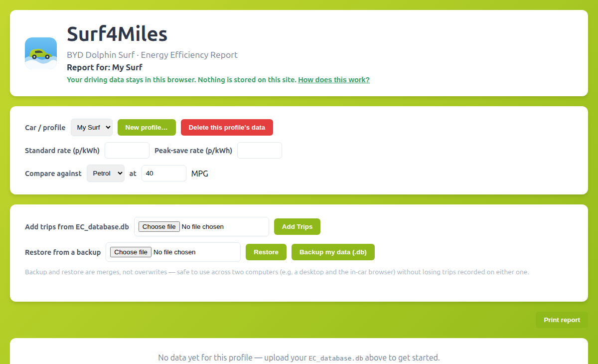
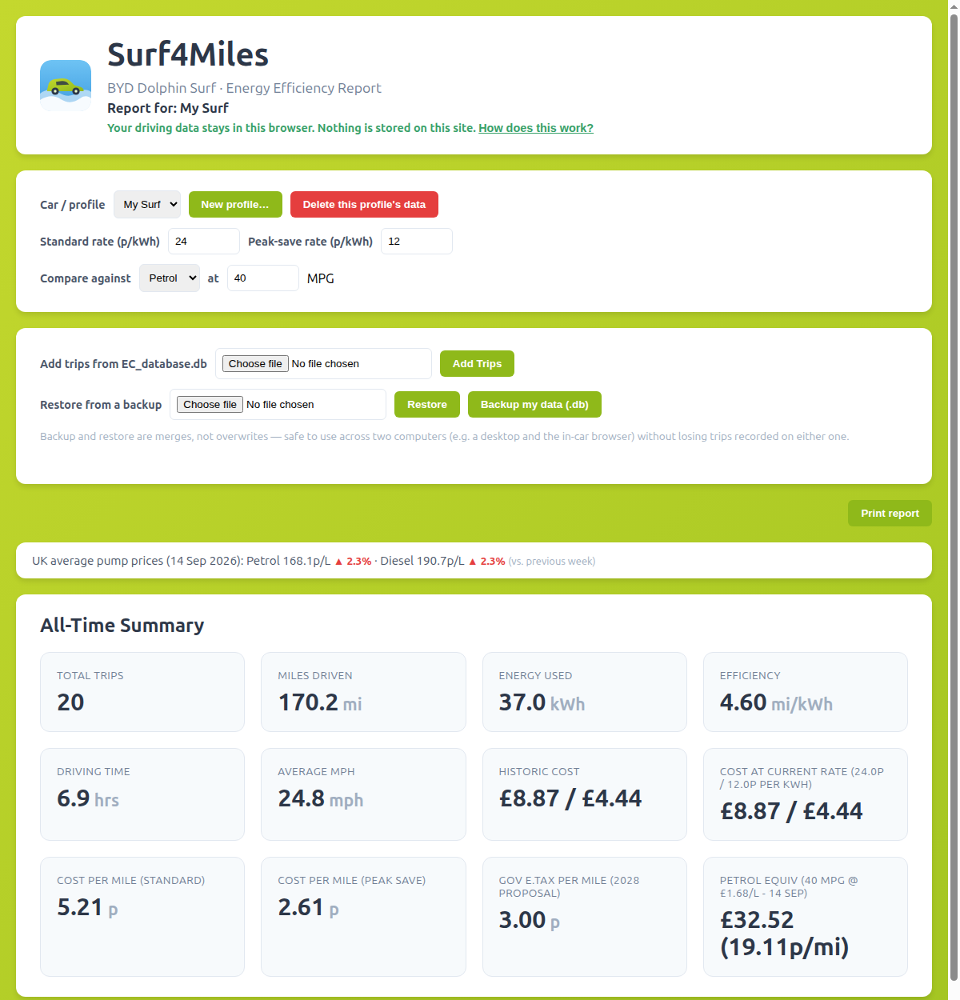

# Surf4Miles: a free energy report for BYD Dolphin Surf owners, without giving up your data

**Images:** `screenshot-onboarding.png`, `screenshot-report.png`

---

I own a BYD Dolphin Surf, and like a lot of EV owners I got curious about the numbers behind my driving fairly quickly: how many miles per kWh am I actually getting, what's that costing me at my electricity tariff, and how does it compare to what a petrol car would cost for the same trips?

The car logs all of this itself — every trip's distance, energy use, and duration is sitting in a file called `EC_database.db`, which you can copy off the car via its USB port. I wrote a small tool to turn that into a proper report for myself. Then I thought other Dolphin Surf owners would probably want the same thing, and started turning it into a website: **Surf4Miles**.

## The constraint that shaped everything

The obvious way to build this for multiple people is the usual way: sign up, upload your data, we store it, you log in to see your report. I didn't want to do that — partly because it's more to build and maintain, but mostly because I didn't want to be responsible for holding a database of strangers' driving habits.

So Surf4Miles works differently:

- **No accounts.** There's nothing to sign up for.
- **Your data stays in your browser.** Your cumulative trip history is kept locally, using a browser storage feature (IndexedDB) — not in a database on the server.
- **Uploads are processed, not stored.** When you upload your car's `EC_database.db`, the server reads it just long enough to calculate your report and hand back the updated numbers, then discards its temporary copy. Nothing is logged or written to permanent storage.

## What the report shows

Once you've uploaded your trip data, you get a report with your all-time totals and a recent-trips summary: total miles, energy used, efficiency in miles/kWh, driving time and average speed, what you've spent historically vs. at your current electricity rate, cost per mile, and a comparison against what the same driving would cost in a petrol or diesel car at your chosen MPG — using the UK's official weekly average fuel prices, with a week-over-week trend indicator.

## A few details I put some thought into

- **Multiple cars.** If your household has more than one Dolphin Surf (or you just want to keep test data separate), you can create named profiles, each with its own local history.
- **Backup and restore.** You can download your cumulative data as a `.db` file at any time, and restore it elsewhere — it merges rather than overwrites, so it's safe to use across two devices (say, a desktop and the in-car browser) without either one losing trips the other recorded.
- **A real outlier filter.** A newly-delivered car's very first logged "trips" are often the factory, the transit boat, and the dealer prep — hours of near-zero movement that aren't real driving. Rather than a fixed date cutoff, Surf4Miles filters on average speed and trip duration, so it generalises to any car's history.
- **It prints cleanly.** If you want a paper copy, there's a one-click print view that fits neatly onto a page.

## Try it

It's free, and it always will be — that's a term of the license it's released under (AGPL-3.0 with the Commons Clause: modifiable and inspectable, but not resellable as a hosted product).

- **Use it:** https://surf4miles.z-add.co.uk/
- **Source code:** https://github.com/StuMP90/suft-miles

Surf4Miles is an independent, fan-made project and isn't affiliated with or endorsed by BYD.
